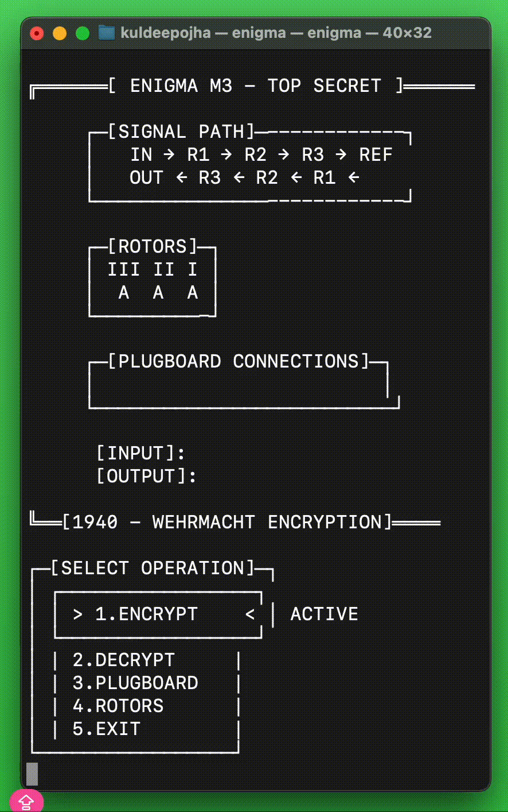
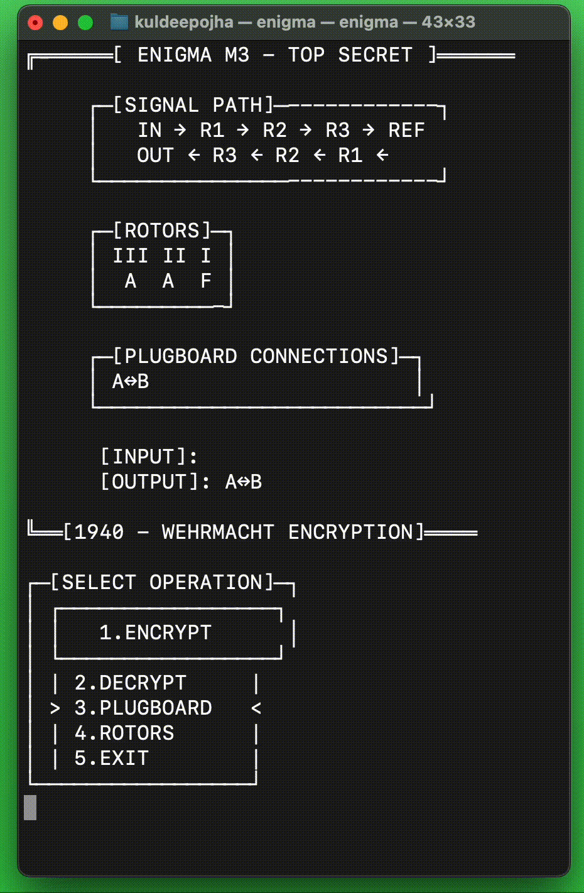
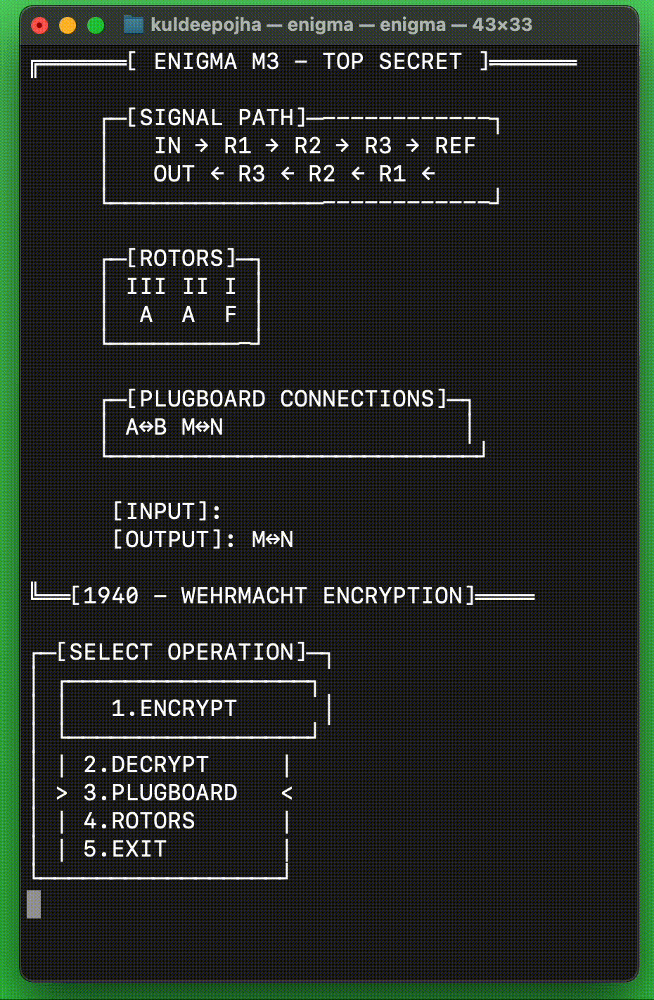

# 🔐 Enigma Machine Simulator

[Live Demo]([https://example.com](http://enigma-machine.s3-website.us-east-2.amazonaws.com/))


A historically accurate simulation of the German Enigma M3 cipher machine used during World War II. This implementation focuses on faithful recreation of the mechanical encryption process using modern C++ and object-oriented programming principles.


## ✨ Features

- 🎮 **Interactive CLI Interface** - User-friendly menu system with visual feedback
- 🔄 **Bidirectional Encryption** - Encrypt and decrypt messages with the same settings
- 🔌 **Configurable Plugboard** - Swap letter pairs for additional encryption complexity
- ⚙️ **Adjustable Rotor Positions** - Set starting positions for all three rotors
- 🎯 **Historical Accuracy** - Uses authentic Enigma rotor wirings and configurations
- 🧪 **Comprehensive Testing** - Unit tests for all components with 90%+ coverage
- 🌐 **Cross-Platform** - Runs on Linux, Windows, and macOS

## 📖 Usage Examples

### Encrypt a Message:




```
Choose option (1-5): 1
Enter message to encrypt: HELLO
Encrypted message: LZFBD
```

### Configure Plugboard:



```
Choose option (1-5): 3
Enter two letters to swap (e.g., AB): HM
Plugboard configured: H <-> M
```

### Set Rotor Positions:



```
Choose option (1-5): 4
Enter positions for left, middle, and right rotors (e.g., AAA): XYZ
Rotor positions set to: XYZ
```

## 🏗️ Architecture Overview

The simulator uses a modular object-oriented design that mirrors the physical Enigma machine:

```
┌─────────────┐    ┌──────────────┐    ┌─────────────┐    ┌─────────────┐
│  Plugboard  │ -> │    Rotors    │ -> │  Reflector  │ -> │   Rotors    │ -> │  Plugboard  │
│   (Input)   │    │ Right|Mid|Left│   │             │    │Lef|Mid|Right│    │  (Output)   │
└─────────────┘    └──────────────┘    └─────────────┘    └─────────────┘    └─────────────┘
```

### Core Components

- **`enigma_machine`** - Main controller orchestrating the encryption process
- **`rotor`** - Individual rotor with scrambled alphabet and rotation mechanics
- **`plugboard`** - Letter pair swapping for additional complexity
- **`EnigmaDisplay`** - Terminal-based user interface with visual feedback

## 🚀 Quick Start

### Prerequisites

- **C++ Compiler** (g++, clang++, or MSVC with C++14 support)
- **CMake** (version 3.14 or higher)
- **Git** (for cloning the repository)

## Installation

### Running with Docker

#### Build the Docker Image

```bash
# Clone the repository
git clone https://github.com/YOUR_USERNAME/enigma-machine.git
cd enigma-machine

# Build the Docker image
docker build -t enigma-simulator .
```

#### Run the Simulator in a Container

```bash
# Interactive mode
docker run -it enigma-simulator

# Or pipe input for automated interactions
echo "1\nHELLO\n5" | docker run -i enigma-simulator
```

### Docker Image Details

- **Base Image**: Ubuntu 22.04 LTS
- **Build Process**:
  1. Install build dependencies (g++, cmake)
  2. Copy project files
  3. Compile the project
  4. Create a minimal runtime image
- **Image Size**: Approximately 100-150 MB
- **Supported Platforms**: Linux, Windows (WSL2), macOS (Intel/M1)

### Building without Docker

```bash
# Clone the repository
git clone https://github.com/YOUR_USERNAME/enigma-machine.git
cd enigma-machine

# Build the project
mkdir build && cd build
cmake ..
make

# Run the simulator
./enigma
```

### Windows Installation

```cmd
# Clone and navigate
git clone https://github.com/YOUR_USERNAME/enigma-machine.git
cd enigma-machine

# Build
mkdir build && cd build
cmake ..
cmake --build . --config Debug

# Run
Debug\enigma.exe
```

## 🎮 How to Use

### Basic Operation

1. **Start the program** - Run `./enigma` from the build directory
2. **Choose operation**:
   - `1` - Encrypt a message
   - `2` - Decrypt a message (same as encrypt with Enigma's reciprocal property)
   - `3` - Configure plugboard connections
   - `4` - Set rotor starting positions
   - `5` - Exit

### Example Encryption Session

```
ENIGMA M3 CIPHER MACHINE
========================

┌─[ROTOR POSITIONS]─────────┐
│ Position: A A A           │
└───────────────────────────┘

┌─[PLUGBOARD]───────────────┐
│ No connections            │
└───────────────────────────┘

INPUT:  [none]
OUTPUT: [none]

Select option (1-5): 1
Enter message to encrypt: HELLO
Encrypted message: LZFBD
```

### Advanced Configuration

#### Setting Rotor Positions
```
Select option (1-5): 4
Current rotor positions: AAA
Enter new rotor positions (3 letters, e.g., ABC): XYZ
Rotor positions set to: XYZ
```

#### Configuring Plugboard
```
Select option (1-5): 3
Enter two letters to connect (or press Enter to skip): AB
Plugboard connection added: A↔B
```

## 🔧 Configuration

### Historical Rotor Settings

The simulator uses authentic Enigma rotor configurations:

- **Rotor I**: `EKMFLGDQVZNTOWYHXUSPAIBRCJ`
- **Rotor II**: `AJDKSIRUXBLHWTMCQGZNPYFVOE`
- **Rotor III**: `BDFHJLCPRTXVZNYEIWGAKMUSQO`
- **Reflector B**: `EJMZALYXVBWFCRQUONTSPIKHGD`

### Customization

To modify rotor configurations, edit the arrays in `main.cpp`:

```cpp
char rotor1_config[26] = {'E', 'K', 'M', 'F', /* ... */};
```

## 🧪 Testing

### Running Tests

```bash
# Run all tests
cd build
ctest -V

# Run specific test suites
./tests/rotor_test
./tests/plugboard_test
./tests/enigma_machine_test
```

### Test Coverage

The project includes comprehensive unit tests covering:

- ✅ Rotor rotation and position management
- ✅ Plugboard letter swapping
- ✅ Complete encryption/decryption cycles
- ✅ Edge cases and boundary conditions
- ✅ Cross-platform compatibility

### Continuous Integration

GitHub Actions automatically runs tests on:
- Ubuntu 22.04
- Windows Latest
- macOS Latest


## 🔬 How It Works

### The Enigma Encryption Process

1. **Input Character**: User types a letter (A-Z)
2. **First Plugboard**: Letter may be swapped if plugboard connection exists
3. **Rotor Stepping**: Right rotor advances, potentially triggering middle/left rotors
4. **Forward Path**: Signal passes through rotors (right → middle → left)
5. **Reflector**: Signal bounces back through reflector
6. **Return Path**: Signal returns through rotors (left → middle → right)
7. **Second Plugboard**: Final letter swap if connection exists
8. **Output**: Encrypted letter displayed

### Key Properties

- **Reciprocal**: Encrypting the same letter twice returns the original
- **No Self-Encryption**: No letter ever encrypts to itself
- **Rotor Stepping**: Position changes affect subsequent encryptions
- **Plugboard**: Adds additional layer of complexity

### Mathematical Foundation

Each rotor implements a substitution cipher that changes with rotor position:
```
Position 0: A→E, B→K, C→M, ...
Position 1: A→K, B→M, C→F, ... (shifted by rotation)
```


## 🐛 Troubleshooting

### Common Issues

**Build fails with CMake version error:**
```bash
# Update CMake to version 3.14+
brew install cmake  # macOS
sudo apt install cmake  # Ubuntu
```

**Tests fail on Windows:**
- Ensure you're running from the correct directory
- Use `Debug\test_name.exe` instead of `./test_name`


*"Sometimes it is the people no one imagines anything of who do the things that no one can imagine."* - Alan Turing
